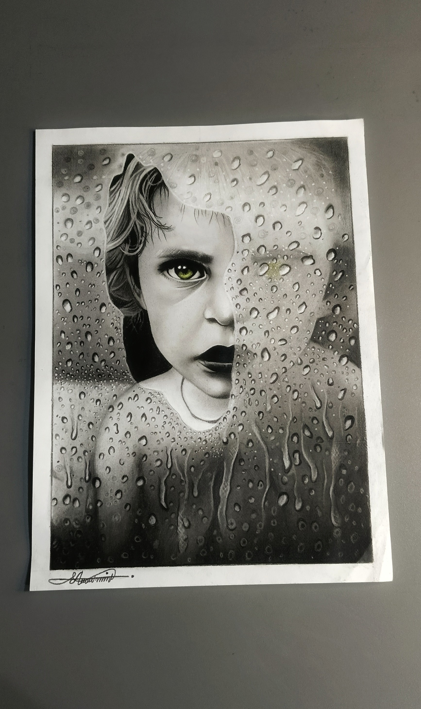
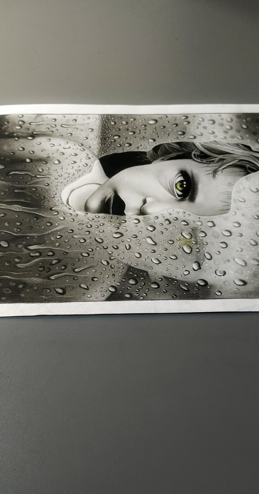
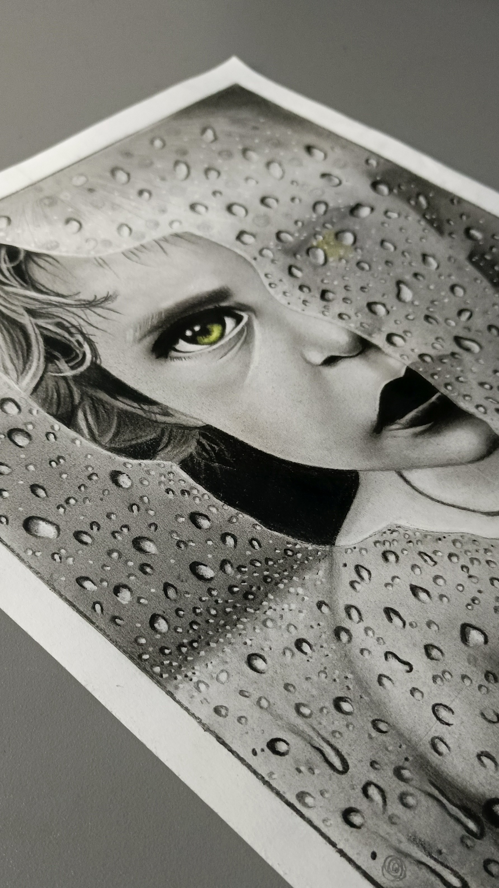

# Hyper-Realistic Sketch: Child Behind Wet Glass

## Overview
Welcome to the repository showcasing an incredibly complex, multi-layered hyper-realistic traditional artwork captured in `w7.jpg`. Created by 18-year-old artist **Abdullah Irfan**, this piece explores the intricate physics of depth of field, transparency, and liquid refraction by depicting a child peering through a glass surface heavily saturated with condensation and water droplets.

---

## Art Specifications
* **Artist:** Abdullah Irfan (Instagram: [@the_shadedartist](https://instagram.com/the_shadedartist))
* **Artist Age:** 18 Years Old
* **Medium:** Premium Matte Graphite Pencils (with a selective colored focal point)
* **Surface Size:** A3 Paper
* **Key Techniques:** 
  * **Layer Separation:** Creating a distinct visual division between the foreground (the physical glass and water beads) and the background portrait.
  * **Light Refraction:** Rendering hundreds of individual water droplets, each containing its own unique shadow, highlight, and inverted refraction pattern.
  * **Specular Contrast:** Leveraging matte graphite to eliminate regular pencil glare, allowing the bright, crisp highlights of the wet glass to look genuinely luminous.

---

## Visual Preview
The original high-resolution photograph of the artwork is stored in this repository as `w7.jpg`.

  
   
   

---

## Creative Process & Technical Complexity
Executed entirely on A3 paper, the structural challenge of this piece was maintaining the soft, slightly obscured features of the child behind the condensation while keeping the water droplets on the glass intensely sharp and sharp-edged. 

By varying the texture density, parts of the face appear realistically blurred by the moisture pooling on the pane, while a selective window of clarity brings immense focus to the child's gaze. The use of matte graphite provides the deep, velvety dark values necessary to make the highlights on the droplets pop with unmistakable three-dimensional realism.

For more behind-the-scenes processes, time-lapses, and full portfolio updates, check out my Instagram profile: **@the_shadedartist**.

---

*Copyright © 2026 Abdullah Irfan (@the_shadedartist). All rights reserved. This image and artwork cannot be used, reproduced, or modified without explicit permission from the artist.*
